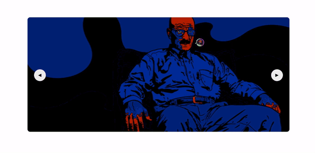

# slidojs
Slido Js is a lightweight weight minimalistic image slider with no dependencies and no styling required. 
<p align="center">
  
</p>

### [Demo](https://codebymani.github.io/slidojs)
### Installation
- [Download the latest release.](https://github.com/codebymani/slidojs/archive/master.zip)
- Clone the repo: `git clone https://github.com/codebymani/slidojs.git`

Injecting minified script directly to the browser as 5.64KB (minified) and 1.67KB (GZipped)
```javascript
  <script src="slido.min.js"></script>
  <script>
    window.onload = function(){
        var demo = slido({
            autoPlay: true,
            idleTime: 3000, // inMilliSeconds
            height: 300,
            speed: 1, //inSeconds
            images: ['assets/01.jpg','assets/02.jpg','assets/01.jpg'],
            id:'slido-demo'
        })
        demo.init();
   };
  </script>
```
